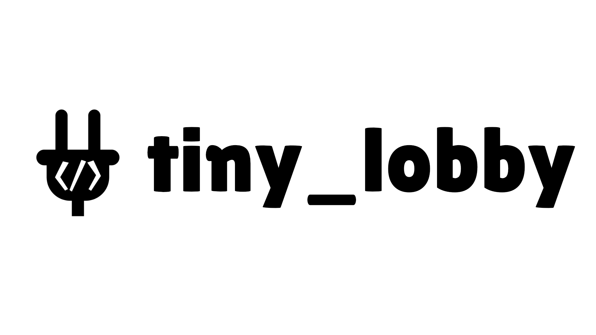

<p align="center">
	 
	<h1 align="center">Tiny Lobby Godot Client</h1> 
</p>

|[Website](https://appsinacup.com)|[Discord](https://discord.gg/56dMud8HYn)|[Build](./BUILD.md)|[tiny_lobby Server](https://github.com/appsinacup/tiny_lobby)|[Starter Project](https://github.com/appsinacup/tiny_lobby_starter)
|-|-|-|-|-|

<p align="center">
		
</p>

Addon that adds multiplayer functionality with nodes that can connect to [tiny_lobby Server](https://github.com/appsinacup/tiny_lobby).


## Features

- Create, join, or leave a lobby.
- Get lobby public data, tags, and a list of lobbies.
- Receive the lobby state and notifications for peer join/leave/kick events.
- Call lobby scripted functions.
- Lock/unlock the lobby.
- Change max players, title, password, or tags.
- Set ready state and update user data.
- Send/receive chat messages.
- Get notifications for peer reconnect/disconnect, user data changes, and public/private data updates.

## Install from Godot Asset Library

Go to Godot `AssetLib` tab and download [Tiny Lobby Client](https://godotengine.org/asset-library/asset/4200).

## Install from GitHub Releases

In order to install, download from latest [GitHub Releases](https://github.com/appsinacup/addon_tiny_lobby_client/releases) the `GDExtension.zip` and place the `addons` folder inside your project.

## Module Build

In order to build module, add it to a godot repo:

```
git submodule add https://github.com/appsinacup/addon_tiny_lobby_client modules/tiny_lobby
cd modules/tiny_lobby
git submodule update --init --recursive
```
