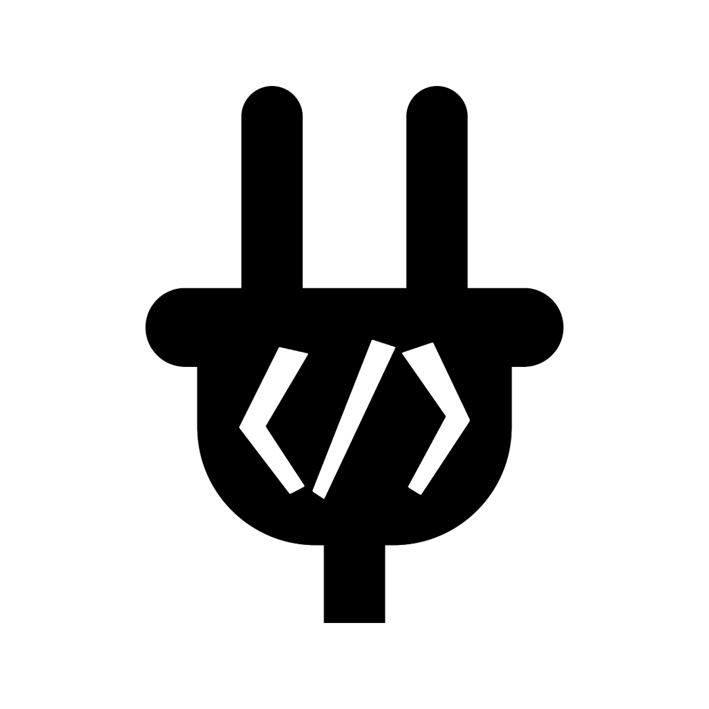

# Tiny Lobby Client Addon

|[Website](https://appsinacup.com)|[Discord](https://discord.gg/56dMud8HYn)|[Build](./BUILD.md)|
|-|-|-|


<p align="center">
		
</p>

Addon that adds nodes that can connect to [Tiny Lobby](https://github.com/appsinacup/tiny_lobby).



## Install

In order to install, download from latest [GitHub Releases](https://github.com/appsinacup/addon_tiny_lobby_client/releases) the `GDExtension.zip` and place the `addons` folder inside your project.

## Module Build

In order to build module, add it to a godot repo:

```
git submodule add https://github.com/appsinacup/addon_tiny_lobby_client modules/tiny_lobby
cd modules/tiny_lobby
git submodule update --init --recursive
```
